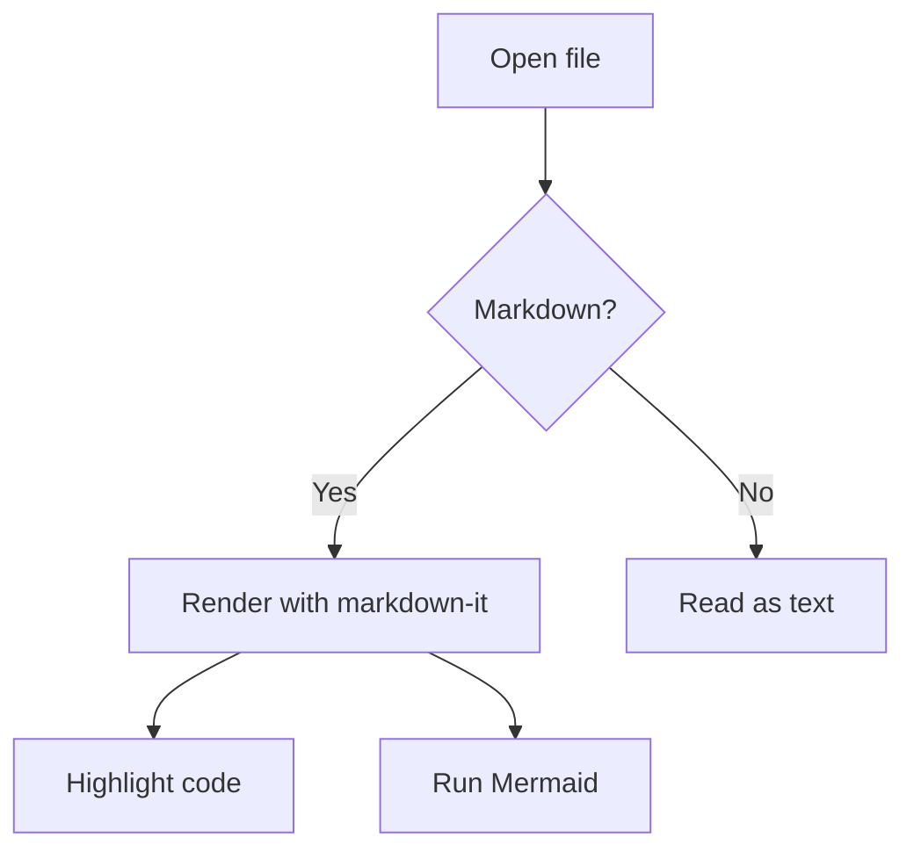
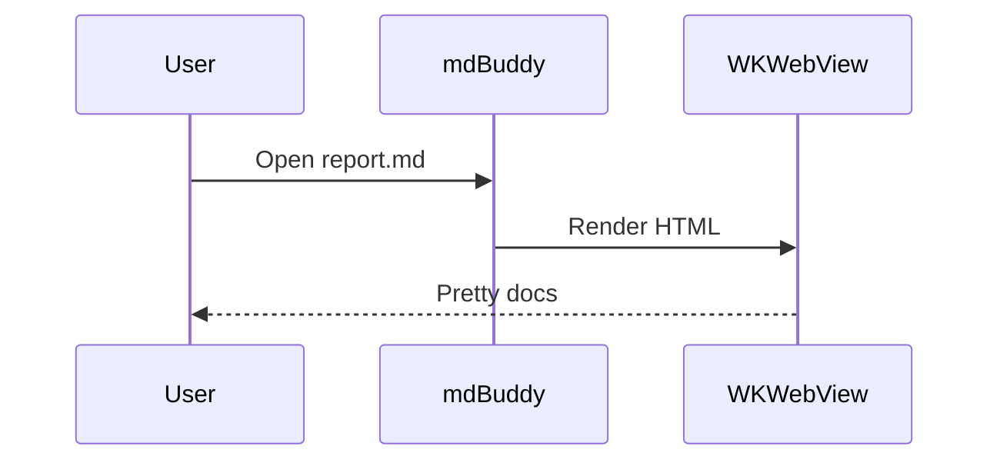

# mdBuddy Sample

A **lightweight** macOS markdown reader. This file exercises every render path.

## Text & formatting

Regular text with *italics*, **bold**, `inline code`, and a [link to Apple](https://www.apple.com).

> Blockquotes render with the GitHub style.

- Bullet one
- Bullet two
  - Nested item
- [ ] A task item
- [x] A done item

## Table

| Feature            | Status |
|--------------------|:------:|
| Markdown render    |   OK   |
| Syntax highlight   |   OK   |
| Mermaid diagrams   |   OK   |
| Auto-reload        |   OK   |

## Code with highlighting

```python
def fib(n: int) -> int:
    a, b = 0, 1
    for _ in range(n):
        a, b = b, a + b
    return a
```

```swift
struct Point { var x = 0; var y = 0 }
let p = Point(x: 3, y: 4)
```

## Mermaid diagram



## Sequence diagram


